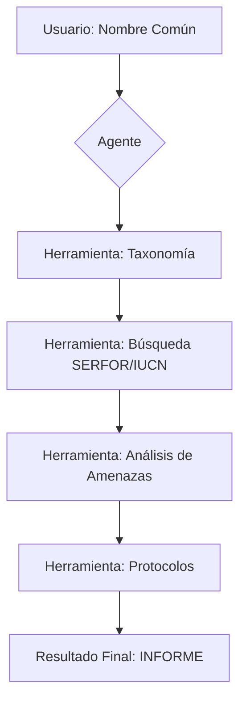

## Asistente de Vigilancia Biológica (Perú) 🐾
BioReport Perú es un agente inteligente que utiliza Inteligencia Artificial y búsquedas en tiempo real para generar informes técnicos de conservación sobre especies de la fauna peruana. El sistema integra validación taxonómica, consulta de estados de amenaza (SERFOR/IUCN) y generación de protocolos biológicos.

## Estructura del Proyecto
El código ha sido desarrollado bajo una arquitectura modular, separando la lógica de decisión, las herramientas de búsqueda y la interfaz de usuario para facilitar su mantenimiento y escalabilidad:

**main.py:** Punto de entrada del programa. Gestiona la interfaz de usuario y el bucle de interacción.

**agent.py:** Contiene la lógica del agente ReAct y la configuración del flujo de trabajo con LangGraph.

**tools.py:** El conjunto de herramientas (Toolkit). Define las funciones de búsqueda web, análisis taxonómico y lógica de protocolos.

**requirements.txt:** Listado de librerías y dependencias necesarias para el funcionamiento del proyecto.

**.env:** Archivo de configuración para variables de entorno y llaves de API (no incluido en el repositorio por seguridad).

## Documentación de Herramientas:
| Herramienta | Descripción Técnica | Entrada | Salida |
| :--- | :--- | :--- | :--- |
| **Identificador Taxonómico** | Valida la identidad biológica | Nombre común | Nombre científico + Descripción |
| **Consulta de Conservación** | Búsqueda web filtrando por normativas (SERFOR). | Nombre científico | Categoría de amenaza (VU, EN, etc.) |
| **Resumidor de Amenazas** | Sintetiza factores de riesgo (minería, deforestación). | Nombre científico | Resumen ejecutivo de amenazas |
| **Generador de Protocolos** | Lógica condicional para decidir acciones. | Nombre + Estado | Plan de Rescate o Monitoreo |

## Flujo de Trabajo
El sistema utiliza un ciclo de razonamiento ReAct (Reasoning + Acting) gestionado por LangGraph. El flujo sigue estos pasos:

**Entrada:** El usuario ingresa una consulta en main.py.

**Razonamiento:** El LLM analiza la consulta y decide qué herramienta de tools.py es necesaria.

**Acción:** Se ejecuta la herramienta. Si es una búsqueda, Tavily extrae datos de la web y el LLM los procesa.

**Observación:** El resultado de la herramienta regresa al Agente.

**Ciclo:** El agente evalúa si tiene información suficiente para completar el formato de INFORME. Si falta algo (ej. el nombre científico para buscar amenazas), repite el ciclo.

**Finalización:** Se formatea la respuesta final y se entrega al usuario a través del thread_id (manteniendo memoria de la conversación).

## Lógica de Decisión
Una parte crítica del flujo es la Lógica Condicional en la herramienta de protocolos. No es una simple respuesta de texto; es una bifurcación:

**Condición A:** Si el estado detectado es Peligro, Crítico o Vulnerable -> Ejecuta prompt_critico.

**Condición B (Default):** Para estados de Preocupación Menor o datos insuficientes -> Ejecuta prompt_monitoreo.

## Instrucciones de Ejecución Local

**1. Obtener el código**

Descargue el proyecto como un archivo ZIP desde el botón verde <> Code en GitHub y extráigalo en su PC.

**2. Instalar las librerías**

Abra su terminal dentro de la carpeta del proyecto y ejecute: pip install -r requirements.txt

**3. Configurar las llaves**

Cree un archivo llamado .env en la carpeta raíz del proyecto y añada sus credenciales de API:

OPENAI_API_KEY=tu_api_key_aquí

TAVILY_API_KEY=tu_api_key_aquí

**4. Iniciar el programa**

Ejecute el script principal para comenzar a interactuar con el agente: python main.py

